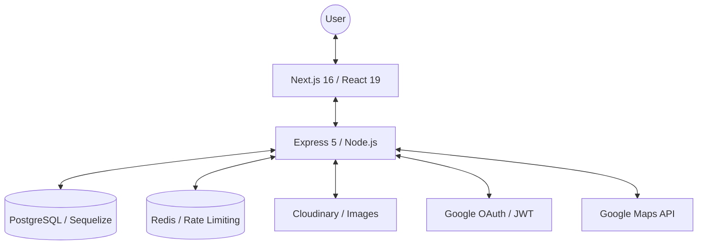

# 🏠 DaoDuck Rental - Modern Rental Listing Platform


<div align="center">
  
  
  
  
  
  
</div>

<p align="center">
  <strong>DaoDuck Rental</strong> is a high-performance, full-stack rental listing platform built with a modern tech stack centered around <strong>Next.js 16 (React 19)</strong> and <strong>Express 5</strong>. Designed with scalability and security in mind, it features a modular architecture, real-time updates, and robust security measures like Redis-based rate limiting.
</p>

---

## 🌟 Key Features

### 🏢 For Users & Renters
- **Advanced Search & Filtering**: Find properties by location, price range, and categories with a responsive, high-performance UI.
- **Interactive Maps**: Seamless integration with **Google Maps API** for precise location viewing.
- **Rich Property Details**: Multi-image uploads via **Cloudinary**, interactive carousels, and rich-text descriptions (Tiptap).
- **User Dashboard**: Personal profile management with real-time statistics (powered by **Recharts**) and audit logs.
- **Google OAuth**: Fast and secure login experience using **Google Identity Services**.

### 🛠️ Technical Excellence
- **Middleware-based Security**: Implemented **Helmet**, **CORS**, and custom JWT-based authentication.
- **Rate Limiting**: Integrated **Redis** for efficient API rate limiting to prevent DDoS attacks and spam.
- **Real-time Communication**: **Socket.io** integration for potential live chat or notification systems.
- **Caching Data**: Using **Redis** for efficient API caching.
---

## 🏗️ System Architecture



---

## 📂 Project Structure (Incomplete)

```text
.
├── apps
│   ├── backend          # Express.js backend logic
│   │   ├── src
│   │   │   ├── modules  # Domain-Driven Modules
│   │   │   └── ...
│   │   └── ...
│   └── frontend         # Next.js 16 frontend
│       ├── app          # App Router & Server Actions
│       ├── components   # UI & Shared Components
│       └── ...
├── assets               # Project images and banners
└── ...
```

---

## 💻 Tech Stack

### Frontend
- **Framework**: [Next.js 16](https://nextjs.org/) (App Router, Server Actions)
- **UI Library**: [React 19](https://react.dev/)
- **Styling**: [Tailwind CSS 4.0](https://tailwindcss.com/) (Next-gen CSS performance)
- **State Management**: [Zustand](https://github.com/pmndrs/zustand) (Flux-like minimalist state)
- **Data Fetching**: [SWR](https://swr.vercel.app/) & [Axios](https://axios-http.com/)
- **Charts**: [Recharts](https://recharts.org/)
- **Icons**: [Lucide React](https://lucide.dev/)

### Backend
- **Framework**: [Express 5](https://expressjs.com/) (Node.js)
- **Database**: [PostgreSQL](https://www.postgresql.org/) with [Sequelize ORM](https://sequelize.org/)
- **Security**: [Redis](https://redis.io/) (Rate limiting), [Helmet](https://helmetjs.github.io/), [Bcrypt](https://github.com/kelektiv/node.bcrypt.js)
- **Validation**: [Zod](https://zod.dev/)
- **Real-time**: [Socket.io](https://socket.io/)
- **Email**: [Nodemailer](https://nodemailer.com/)

---

## 🚀 Getting Started

### Prerequisites
- Node.js (v18+)
- PostgreSQL
- Redis
- Cloudinary Account & Google Console Project (for API Keys)

### 📦 Installation & Setup

Choose one of the following methods to get the project running:

#### Method 1: Docker (Coming Soon 🚧)
> **Note**: Docker support is currently in development.

```bash
# Clone the repository
git clone https://github.com/DaoDuck3008/Rental-Listing-Platform.git
cd Rental-Listing-Platform

# Start services with Docker Compose
docker-compose up --build
```

#### Method 2: Manual Installation (Recommended)

1. **Clone the repository**:
   ```bash
   git clone https://github.com/DaoDuck3008/Rental-Listing-Platform.git
   cd Rental-Listing-Platform
   ```

2. **Backend Setup**:
   ```bash
   cd apps/backend
   npm install
   # Create .env based on .env.example and configure DB/Redis
   npm run dev
   ```

3. **Frontend Setup**:
   ```bash
   cd apps/frontend
   npm install
   # Create .env based on .env.example
   npm run dev
   ```

---

## 🎨 Preview

| Dashboard Stats | Property Search |
| :---: | :---: |
|  |  |

---

## 👨‍💻 Author

**Dao Anh Duc**
- LinkedIn: [Your Profile](https://linkedin.com/in/your-profile)
- GitHub: [@DaoDuck3008](https://github.com/DaoDuck3008)

---
*Developed as part of a high-performance rental solution project.*
