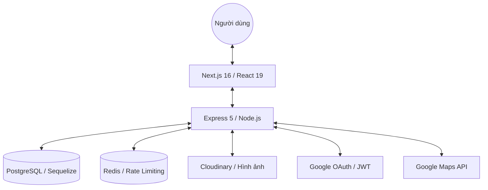

# 🏠 DaoDuck Rental - Nền tảng Cho thuê Bất động sản Hiện đại


<div align="center">
  
  
  
  
  
  
</div>

<p align="center">
  🌍 <b>Ngôn ngữ:</b> <a href="README.md">English</a> | <b>Tiếng Việt</b>
</p>

<p align="center">
  <strong>DaoDuck Rental</strong> là một ứng dụng cho thuê bất động sản full-stack hiệu năng cao, được xây dựng với các công nghệ hiện đại nhất hiện nay như <strong>Next.js 16 (React 19)</strong> và <strong>Express 5</strong>. Dự án được thiết kế tập trung vào khả năng mở rộng và bảo mật, sử dụng kiến trúc modular, cập nhật dữ liệu thời gian thực và các biện pháp bảo mật nâng cao như giới hạn lưu lượng (rate limiting) bằng Redis.
</p>

<p align="center">
  🔗 <b>Kho mã nguồn:</b> <a href="https://github.com/DaoDuck3008/FE-Rental-Listing-Platform">Frontend</a> | <a href="https://github.com/DaoDuck3008/BE-Rental-Listing-Platform">Backend</a>
</p>

---

## 🌟 Tính năng Chính

### 🏢 Dành cho Người dùng & Người thuê
- **Tìm kiếm & Lọc nâng cao**: Tìm kiếm bất động sản theo vị trí, khoảng giá và danh mục với giao diện phản hồi nhanh, hiệu năng cao.
- **Bản đồ Tương tác**: Tích hợp mượt mà với **Google Maps API** để xem vị trí chính xác.
- **Chi tiết Bất động sản**: Tải lên nhiều hình ảnh qua **Cloudinary**, carousel tương tác và mô tả văn bản giàu định dạng (Tiptap).
- **Trang quản trị người dùng**: Quản lý hồ sơ cá nhân với thống kê thời gian thực (sử dụng **Recharts**) và nhật ký hoạt động (audit logs).
- **Google OAuth**: Trải nghiệm đăng nhập nhanh chóng và bảo mật bằng **Google Identity Services**.

### 🛠️ Kỹ thuật Nổi bật
- **Bảo mật dựa trên Middleware**: Triển khai **Helmet**, **CORS** và xác thực tùy chỉnh dựa trên JWT.
- **Giới hạn lưu lượng (Rate Limiting)**: Tích hợp **Redis** để giới hạn số lượng request hiệu quả, ngăn chặn tấn công DDoS và spam.
- **Giao tiếp Thời gian thực**: Tích hợp **Socket.io** cho hệ thống chat trực tiếp hoặc thông báo.
- **Bộ nhớ đệm dữ liệu (Caching)**: Sử dụng **Redis** để tăng tốc độ truy vấn API.

---

## 🏗️ Kiến trúc Hệ thống



---

## 📂 Cấu trúc Dự án (Chưa hoàn thiện)

```text
.
├── apps
│   ├── backend          # Logic backend Express.js
│   │   ├── src
│   │   │   ├── modules  # Các module nghiệp vụ (Domain-Driven)
│   │   │   └── ...
│   │   └── ...
│   └── frontend         # Frontend Next.js 16
│       ├── app          # App Router & Server Actions
│       ├── components   # UI & Các component dùng chung
│       └── ...
├── assets               # Hình ảnh và banner dự án
└── ...
```

---

## 💻 Công nghệ Sử dụng

### Frontend
- **Framework**: [Next.js 16](https://nextjs.org/) (App Router, Server Actions)
- **UI Library**: [React 19](https://react.dev/)
- **Styling**: [Tailwind CSS 4.0](https://tailwindcss.com/) (Hiệu năng CSS thế hệ mới)
- **Quản lý State**: [Zustand](https://github.com/pmndrs/zustand) (Quản lý state tối giản kiểu Flux)
- **Data Fetching**: [SWR](https://swr.vercel.app/) & [Axios](https://axios-http.com/)
- **Biểu đồ**: [Recharts](https://recharts.org/)
- **Icons**: [Lucide React](https://lucide.dev/)

### Backend
- **Framework**: [Express 5](https://expressjs.com/) (Node.js)
- **Database**: [PostgreSQL](https://www.postgresql.org/) với [Sequelize ORM](https://sequelize.org/)
- **Bảo mật**: [Redis](https://redis.io/) (Rate limiting), [Helmet](https://helmetjs.github.io/), [Bcrypt](https://github.com/kelektiv/node.bcrypt.js)
- **Xác thực dữ liệu**: [Zod](https://zod.dev/)
- **Thời gian thực**: [Socket.io](https://socket.io/)
- **Email**: [Nodemailer](https://nodemailer.com/)

---

## 🚀 Bắt đầu

### Yêu cầu hệ thống
- Node.js (v18+)
- PostgreSQL
- Redis
- Tài khoản Cloudinary & Google Console Project (để lấy API Keys)

### 📦 Cài đặt & Thiết lập

Chọn một trong các phương thức sau để chạy dự án:

#### Cách 1: Docker (Cách cài đặt nhanh nhất)

1. **Clone repository**:
   ```bash
   git clone https://github.com/DaoDuck3008/Rental-Listing-Platform.git
   cd Rental-Listing-Platform
   ```

2. **Thiết lập biến môi trường**:
   Tạo file `.env` từ file `.env.example` ở cả hai thư mục frontend và backend.
   ```bash
   cp apps/backend/.env.example apps/backend/.env
   cp apps/frontend/.env.example apps/frontend/.env
   ```

3. **Chạy toàn bộ dịch vụ**:
   ```bash
   docker-compose up --build -d
   ```
   > **Ghi chú**: Ứng dụng sẽ tự động chạy tại `http://localhost:3000`. Docker Compose sẽ lo toàn bộ việc khởi tạo cơ sở dữ liệu (PostgreSQL, Redis), Backend (cổng 5000) và Frontend. Đặc biệt Backend sẽ tự động chạy migration để tạo các bảng trong cơ sở dữ liệu.

4. **Nạp dữ liệu mẫu (Seeder - Tùy chọn)**:
   Sau khi các dịch vụ đã hoạt động ổn định, hãy gõ lệnh sau ở một cửa sổ terminal mới để nạp dữ liệu mẫu ban đầu vào cơ sở dữ liệu:
   ```bash
   docker exec -it rental_backend npx sequelize-cli db:seed:all
   ```

#### Cách 2: Cài đặt thủ công (Nếu bạn không dùng Docker)

1. **Clone repository**:
   ```bash
   git clone https://github.com/DaoDuck3008/Rental-Listing-Platform.git
   cd Rental-Listing-Platform
   ```

2. **Thiết lập Backend**:
   ```bash
   cd apps/backend
   npm install
   # Hãy chắc chắn rằng PostgreSQL và Redis của bạn đang chạy!
   # Tạo file .env dựa trên .env.example và cấu hình DB/Redis
   npm run dev
   ```

3. **Thiết lập Frontend**:
   ```bash
   cd apps/frontend
   npm install
   # Tạo file .env dựa trên .env.example
   npm run dev
   ```

---

## 🎨 Xem trước

| Thống kê Dashboard | Tìm kiếm Bất động sản |
| :---: | :---: |
|  |  |

---

## 👨‍💻 Tác giả

**Dao Anh Duc**
- LinkedIn: [Hồ sơ của bạn](https://linkedin.com/in/your-profile)
- GitHub: [@DaoDuck3008](https://github.com/DaoDuck3008)

---
*Được phát triển như một phần của giải pháp cho thuê bất động sản hiệu năng cao.*
